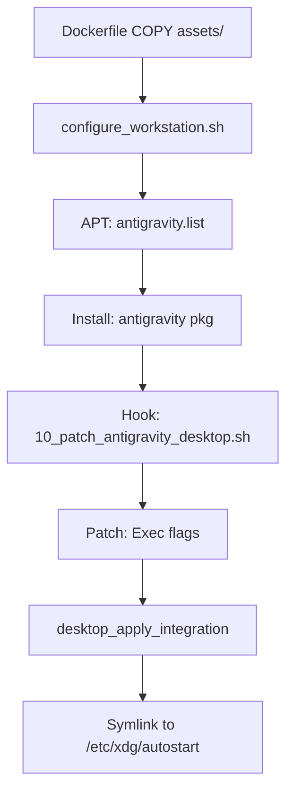

<!--
Copyright 2026 Google LLC

Licensed under the Apache License, Version 2.0 (the "License");
you may not use this file except in compliance with the License.
You may obtain a copy of the License at

    https://www.apache.org/licenses/LICENSE-2.0

Unless required by applicable law or agreed to in writing, software
distributed under the License is distributed on an "AS IS" BASIS,
WITHOUT WARRANTIES OR CONDITIONS OF ANY KIND, either express or implied.
See the License for the specific language governing permissions and
limitations under the License.
-->

# Antigravity Layer Architecture

The **Antigravity Layer** provides a specialized development environment on top of the GNOME foundation. It follows a "thin layer" philosophy, centralizing core system logic in the base image and utilizing declarative configuration for application-specific tools.

## Layer Responsibility

| Feature | Responsibility | Integration Method |
| :--- | :--- | :--- |
| **Toolchain** | Antigravity desktop shell and dashboard | Declarative (`EXTRA_PKGS`) |
| **Repos** | Custom APT sources for automated updates | Asset Injection (`/etc/apt/`) |
| **Desktop UX** | Session autostart and custom icons | XDG Autostart & Desktop Files |

## Build-Time Integration

This layer leverages the base blueprint's `configure_workstation.sh` to perform automated setup.

1.  **Asset Injection**: The `Dockerfile` copies `assets/` to the image root, placing repository configs and desktop entries.
2.  **Centralized Setup**: The base setup script automatically detects the `EXTRA_PKGS` environment variable, handles regional APT configuration, and executes any optional scripts in `assets/build-hooks.d/`.
3.  **Post-Install Hook**: This layer uses a post-install hook (`assets/post-install-hooks.d/10_patch_antigravity_desktop.sh`) to perform late-stage patching of the Antigravity desktop entry, injecting required flags (e.g., `--disable-gpu`) after the package is installed.

## Session Lifecycle

Antigravity integrates with the GNOME session via standard XDG mechanisms:
*   **Autostart**: The application launches automatically when the user connects via RDP.
*   **Inheritance**: Inherits all systemd services and environment variables from the GNOME foundation.

## Cross-Layer Dependencies

*   **GNOME Layer (Parent)**: Provides the Wayland compositor and the Guacamole gateway. Antigravity will fail to start if the GNOME session is not active.
*   **Agent Development Kit (ADK)**: This layer propagates the `INSTALL_AGENT_DEVELOPMENT_KIT_PYTHON` argument to the base layer, ensuring the ADK is present for advanced developer personas.
