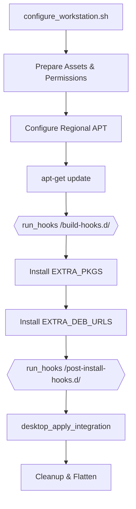
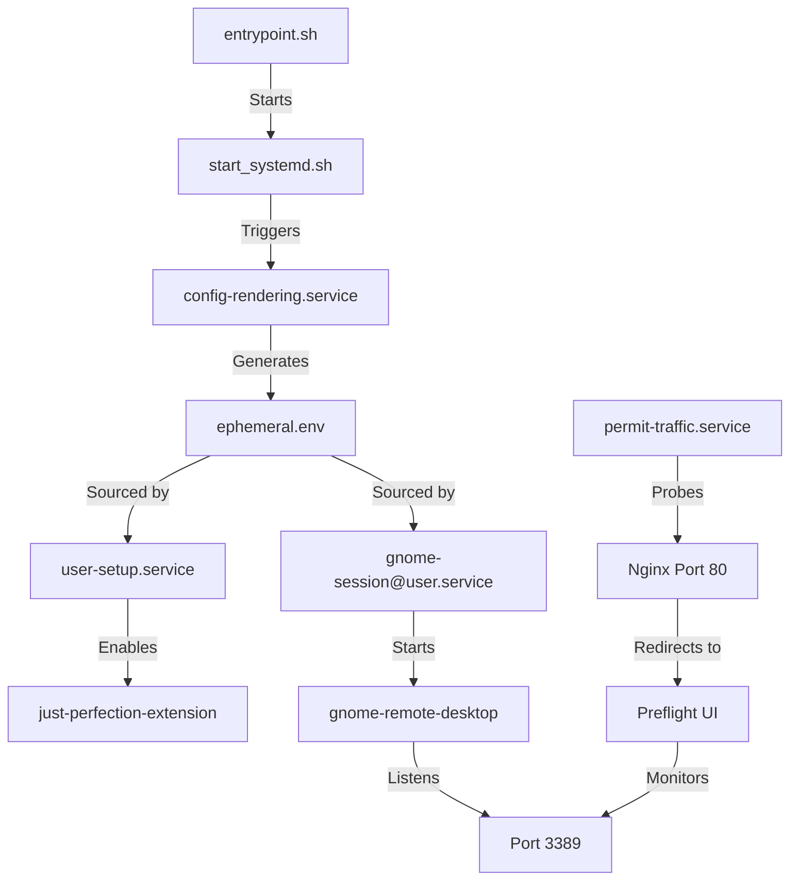
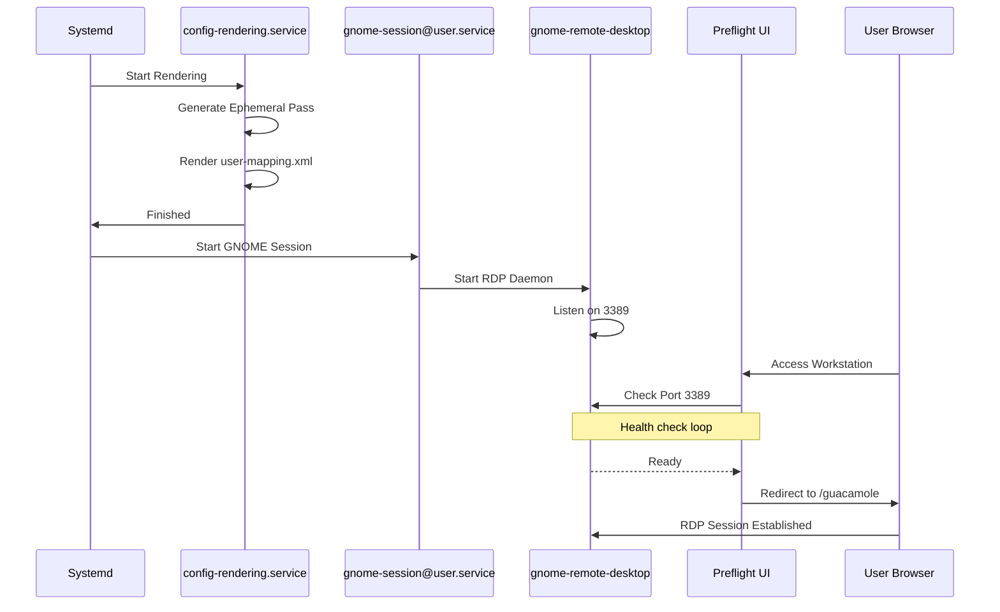
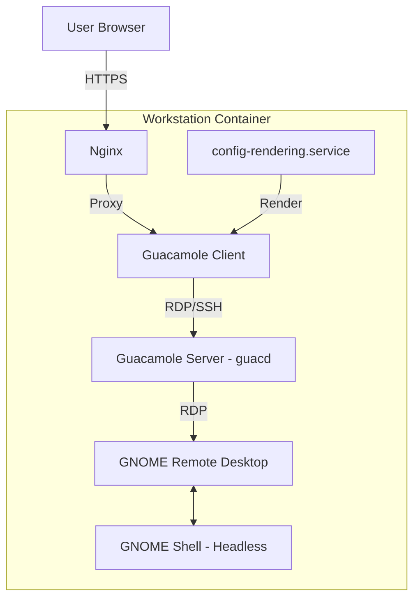

<!--
Copyright 2026 Google LLC

Licensed under the Apache License, Version 2.0 (the "License");
you may not use this file except in compliance with the License.
You may obtain a copy of the License at

    https://www.apache.org/licenses/LICENSE-2.0

Unless required by applicable law or agreed to in writing, software
distributed under the License is distributed on an "AS IS" BASIS,
WITHOUT WARRANTIES OR CONDITIONS OF ANY KIND, either express or implied.
See the License for the specific language governing permissions and
limitations under the License.
-->

# GNOME Layer Architecture

This document defines the technical architecture of the **GNOME Desktop Layer**. It focuses on graphical session orchestration, remote desktop protocols, and the transition from the base image to a functional desktop environment.

## Layer Responsibility

The GNOME layer is responsible for providing a performant, headless graphical environment within the workstation container. It sits on top of the **Base OS** and receives control after the **Preflight** readiness checks.

| Feature | Responsibility | Technology |
| :--- | :--- | :--- |
| **Display Server** | Headless Wayland session | GNOME Shell + Mutter |
| **Remote Access** | Web-to-RDP Gateway | Apache Guacamole + `gnome-remote-desktop` |
| **Orchestration** | Service lifecycle and ordering | Native Systemd |
| **Authentication** | Ephemeral credential generation | OpenSSL + `envsubst` |

## Build-Time Orchestration

The image build process is managed by a centralized configuration script that provides standard extension points for child layers.

1.  **Build-Time Hooks**: Executed *before* package installation. Used for repository setup, custom binary injection, or pre-requisite configuration.
2.  **Post-Install Hooks**: Executed *after* all packages are installed but *before* the desktop integration logic runs. This is the primary point for patching files provided by third-party `.deb` packages.

## Systemd Service Flow

The following diagram illustrates the dependency chain and execution order of the core system services.

## The Startup Sequence (GNOME Focus)

GNOME orchestration is integrated into the broader workstation startup sequence.

1.  **Rendering Stage**:
    *   `config-rendering.service` generates an ephemeral password.
    *   It renders the `user-mapping.xml` used by Guacamole to authenticate with the desktop.
2.  **Desktop Initialization**:
    *   `user-setup.service` configures the unprivileged user's environment.
    *   It unlocks the GNOME Keyring (using the ephemeral password) and configures the `just-perfection` extension to hide screen-sharing indicators.
3.  **Graphical Session**:
    *   `gnome-session@user.service` starts a headless Wayland shell.
    *   The `gnome-remote-desktop-daemon` begins listening on the RDP port (3389).
4.  **Gateway Handover**:
    *   The Preflight UI detects the active RDP listener.
    *   The browser is automatically redirected to the Guacamole endpoint, which proxys the RDP session to the user.

## Architectural Components

## Architectural Principles

### 1. Native Systemd Handoff
This layer utilizes a declarative systemd pattern (`multi-user.target.d/10-workstation.conf`) to ensure all graphical services are enabled without manual script management.

### 2. Headless Performance
To maintain low latency and high stability in a containerized environment, the GNOME layer:
*   Forces software rendering (`LIBGL_ALWAYS_SOFTWARE=1`) to avoid GPU compatibility issues.
*   Uses a dedicated systemd user drop-in to force the shell into `--headless` mode.

### 3. Ephemeral Security
Credentials for the RDP session are generated uniquely for every workstation start and are never persisted to disk beyond the lifetime of the container.

## Cross-Layer Dependencies

*   **Preflight (Parent)**: This layer relies on the Nginx configuration provided by the Preflight stage to intercept early traffic and provide the loading experience.
*   **AI Integration & Gemini CLI**: The blueprint natively includes the **Gemini CLI** as a core component for developer productivity, automation, and persona-driven development, providing context-aware AI assistance directly within the terminal.
*   **Downstream Apps (Children)**: Higher-level layers (like Antigravity) integrate with this layer via two mechanisms:
    *   **Build-time Hooks** (`assets/build-hooks.d/`): To install additional tools and perform pre-installation setup.
    *   **Post-Install Hooks** (`assets/post-install-hooks.d/`): To patch or configure system files after package installation but before final desktop integration.
