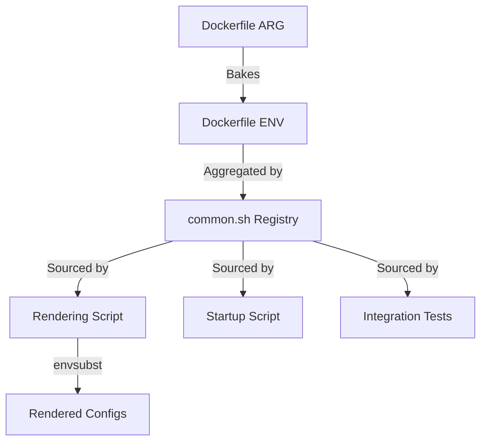

<!--
Copyright 2026 Google LLC

Licensed under the Apache License, Version 2.0 (the "License");
you may not use this file except in compliance with the License.
You may obtain a copy of the License at

    https://www.apache.org/licenses/LICENSE-2.0

Unless required by applicable law or agreed to in writing, software
distributed under the License is distributed on an "AS IS" BASIS,
WITHOUT WARRANTIES OR CONDITIONS OF ANY KIND, either express or implied.
See the License for the specific language governing permissions and
limitations under the License.
-->

# Environment Variable Management

This document defines the architecture and "Source of Truth" hierarchy for configuration used across the workstation layers.

## 1. Source of Truth Hierarchy

1.  **Dockerfile (Build-time Defaults)**: Defines initial `ARG` and `ENV` values.
2.  **`common.sh` (The Registry)**: Aggregates ENVs and provides calculated defaults for all scripts.

## 2. Centralized Configuration Registry

### User Identity & Connections

- `WORKSTATION_USER`: Unprivileged session user (default: `user`).
- `WORKSTATION_UID`: Numeric ID of the user (default: `1000`).
- `RDP_HOST` / `RDP_PORT`: Internal target for RDP (127.0.0.1:3389).
- `SSH_HOST` / `SSH_PORT`: Internal target for SSH (127.0.0.1:22).

## 3. Variable Inheritance Flow

