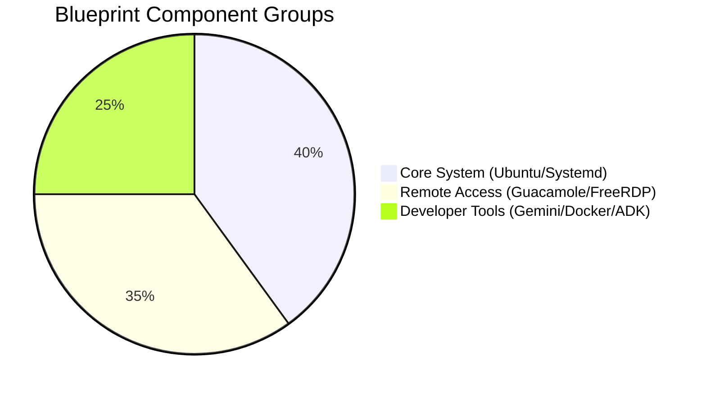

<!--
Copyright 2026 Google LLC

Licensed under the Apache License, Version 2.0 (the "License");
you may not use this file except in compliance with the License.
You may obtain a copy of the License at

    https://www.apache.org/licenses/LICENSE-2.0

Unless required by applicable law or agreed to in writing, software
distributed under the License is distributed on an "AS IS" BASIS,
WITHOUT WARRANTIES OR CONDITIONS OF ANY KIND, either express or implied.
See the License for the specific language governing permissions and
limitations under the License.
-->

# Software Bill of Materials (SBOM) Guide

This project maintains a curated Software Bill of Materials (SBOM) to track dependencies, versions, and licenses. This ensures transparency and compliance with open-source legal requirements.

## Technology Composition

## The SBOM Manifest

The source of truth for all included software is:
`examples/preflight/web/public/sbom.json`

### Schema Definition
Each component in the `components` array must reference a `license_id` from the top-level `licenses` object.
- `name`: Human-readable name (e.g., "Docker").
- `version`: Verified version (e.g., "29.3.1").
- `group`: Functional category for UI grouping.
- `supplier`: The organization or individual providing the software (labeled as "Author" for creative assets).
- `url`: Official project homepage (labeled as "Photo Page" for Unsplash assets).
- `repository`: Technical source code location (labeled as "Author Profile" for Unsplash assets).

## Display & Implementation

### 1. Dedicated Legal Route
The environment exposes a dedicated `/licenses` route via Nginx, which redirects to the startup page and automatically opens the SBOM viewer.

### 2. Implementation Logic (Clean TypeScript)
The frontend logic resides in `examples/preflight/web/sbom_module.ts`.
- **Pre-compilation**: The `Dockerfile` utilizes a modern frontend bundler (**Vite**) in a multi-stage build to compile the source and assemble the static assets into `examples/preflight/web/dist/`. Only these compiled assets are copied to the final image.
- **Dynamic Attribution**: The UI automatically adjusts terminology based on license type, ensuring technically accurate descriptions for both code and creative assets.
- **Loading Robustness**: The system utilizes proactive rendering and loading states to ensure the manifest is always visible and synchronized upon modal entry.

### 3. Image Freshness & Offline Access
All license texts are pre-downloaded during the build process using the official **SPDX** raw text repository. This ensures:
- Compliance even if the workstation has no external internet access.
- Auditability of the exact legal terms included in a specific image version.

## Maintenance

To update the SBOM or add new projects:
1.  Edit `examples/preflight/web/public/sbom.json`.
2.  Run `skills/enforce-standards/scripts/sync_license_assets.sh` to download new assets.
3.  Commit the JSON and the updated license files.
