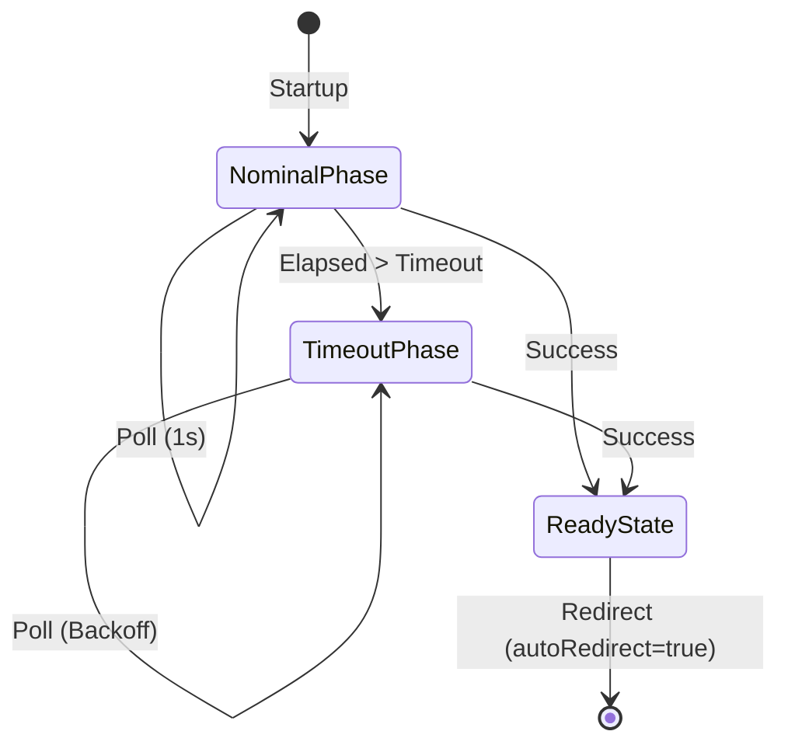

<!--
Copyright 2026 Google LLC

Licensed under the Apache License, Version 2.0 (the "License");
you may not use this file except in compliance with the License.
You may obtain a copy of the License at

    https://www.apache.org/licenses/LICENSE-2.0

Unless required by applicable law or agreed to in writing, software
distributed under the License is distributed on an "AS IS" BASIS,
WITHOUT WARRANTIES OR CONDITIONS OF ANY KIND, either express or implied.
See the License for the specific language governing permissions and
limitations under the License.
-->

# Cloud Workstations Preflight Module

Web-based loading experience for Google Cloud Workstations.

## Features

### Phased Monitoring State Machine

### Built-in Simulation

Test behavior using URL parameters:

- `?simulateDelay=15`: Simulate 15s startup.
- `?autoRedirect=false`: Pause at the READY screen.
- `?timeout=10`: Start backoff after 10s.
