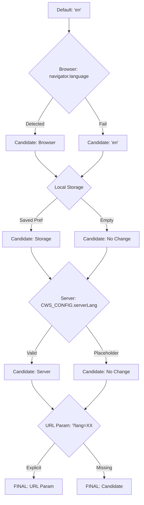

<!--
Copyright 2026 Google LLC

Licensed under the Apache License, Version 2.0 (the "License");
you may not use this file except in compliance with the License.
You may obtain a copy of the License at

    https://www.apache.org/licenses/LICENSE-2.0

Unless required by applicable law or agreed to in writing, software
distributed under the License is distributed on an "AS IS" BASIS,
WITHOUT WARRANTIES OR CONDITIONS OF ANY KIND, either express or implied.
See the License for the specific language governing permissions and
limitations under the License.
-->

# Language Selection & Priorities

This document describes how the Preflight UI determines which language to display to the user.

## Priority Flow

## Behavior Matrix

To ensure operational accuracy, the Preflight dashboard enforces a strict data priority hierarchy where environment metadata overrides persisted preferences.

| Source              | Example                              | Priority    |
| :------------------ | :----------------------------------- | :---------- |
| **URL Parameter**   | `?lang=es`                           | 1 (Highest) |
| **Server Meta**     | `window.CWS_CONFIG.serverLang`       | 2           |
| **Local Storage**   | `localStorage.getItem('cws_config')` | 3           |
| **Browser Default** | `navigator.language`                 | 4           |
| **System Fallback** | `en`                                 | 5 (Lowest)  |
