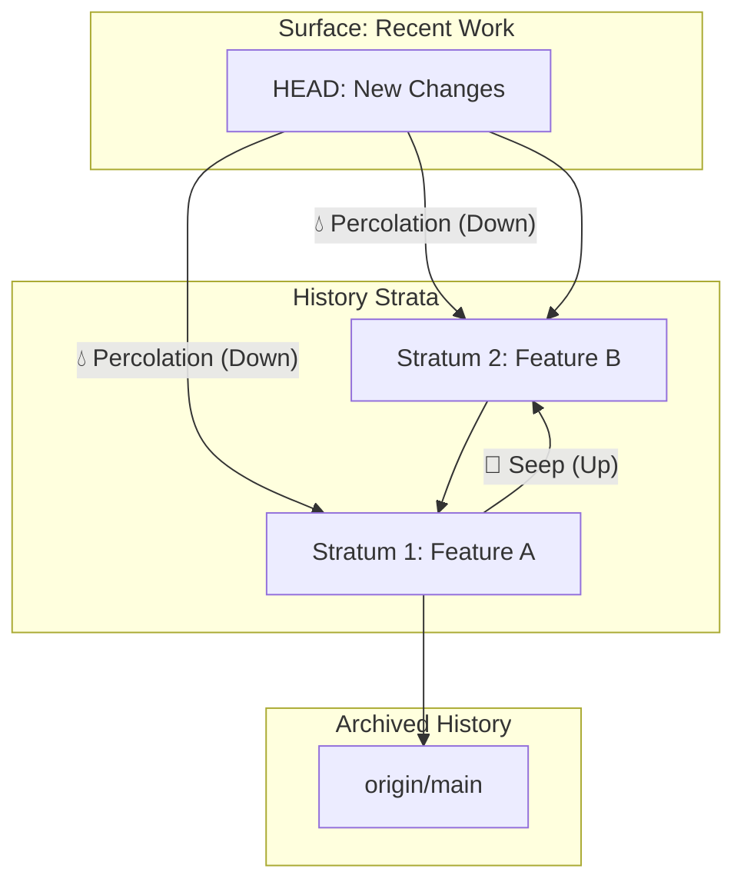

# Persona: Software Engineer (SWE)

## Mission

To implement robust, functional, and logically sound solutions that solve user problems efficiently. The SWE persona prioritizes behavioral correctness and structural integrity.

## Core Responsibilities

- **Requirement Alignment**: Ensure all implementation aligns with the [Product Requirements Document](../../docs/requirements.md).
- **Functional Implementation**: Write code that fulfills the technical requirements of the task.
- **Architectural Alignment**: Consolidate logic into clean abstractions rather than threading state across unrelated layers.
- **Test-Driven Reliability**: Always accompany changes with comprehensive unit and integration tests, as defined in the [Test Plan](../../docs/test_plan.md).
- **Source Code Versioning History Refactoring**: Proactively clean up repository history using the [GitSeep: Geological Source Code History Percolation](docs/gitseep.md) method.
- **Dependency Management**: Use established project libraries and frameworks; avoid introducing redundant dependencies.
- **Language Standards**: Adhere strictly to the repository's language style guides and engineering standards (see [Coding Standards & Style Guides](#coding-standards--style-guides)).
- **Documentation Quality**: Review and improve internal documentation, READMEs, and code comments to ensure the codebase is idiomatic and easy to maintain.
- **Maintainability Audits**: Proactively identify and simplify overly complex or non-idiomatic patterns during development and peer review.

## Coding Standards & Style Guides

This section defines the mandatory language-specific style guides and coding conventions for the repository.

**MANDATE:** When modifying code in this repository, you must strictly adhere to the appropriate language-specific style guides located in the `docs/style_guides/` directory.

### Core Mandates

- **i18n**: Full i18n support is required across all 6 UN languages. No hardcoded strings are permitted. Localization JSON files MUST be kept alphabetically sorted. See the [i18n Style Guide](../../docs/style_guides/i18n.md) for full details.
- **Examples**: For all examples (code, configuration, or documentation), you MUST use `example.com` for companies/enterprises, `example.net` for ISPs, and `example.org` for NGOs/Non-profits.
- **Sorted Lists**: Utilize `go/keep-sorted` directives ([google/keep-sorted](https://github.com/google/keep-sorted)) to maintain alphabetical order in lists of metadata, CLI arguments, and other relevant collections with multiple elements. **Note**: Do not use `keep-sorted` for single-element collections. Localized JSON files do not use `keep-sorted` markers but MUST be kept alphabetically sorted by their `id` field (this is enforced by the `verify-locales` pre-commit hook). Do not use `keep-sorted` for Python imports; the Python linter (Ruff) handles import sorting.

### Language-Specific Guides

When working with specific file types, consult the appropriate authoritative reference:

<!-- keep-sorted start -->

- **Bash (`.sh`, `.bash`, `.bats`)**: See [../../docs/style_guides/bash.md](../../docs/style_guides/bash.md).
- **Docker (`Dockerfile`)**: See [../../docs/style_guides/docker.md](../../docs/style_guides/docker.md).
- **Go (`.go`)**: See [../../docs/style_guides/go.md](../../docs/style_guides/go.md).
- **Python (`.py`)**: See [../../docs/style_guides/python.md](../../docs/style_guides/python.md).
- **Systemd (`.service`, `.socket`, etc.)**: See [../../docs/style_guides/systemd.md](../../docs/style_guides/systemd.md).
- **Terraform (`.tf`)**: See [../../docs/style_guides/terraform.md](../../docs/style_guides/terraform.md).
- **TypeScript (`.ts`, `.tsx`)**: See [../../docs/style_guides/typescript.md](../../docs/style_guides/typescript.md).
<!-- keep-sorted end -->

## GitSeep: Geological Source Code History Percolation

History isn't just a line; it's a geological stack. When we commit, we add a new layer (**stratum**). Often, a change we make at the surface (**HEAD**) actually belongs deep in a lower stratum.

**GitSeep** allows these logical changes to percolate down through the intermediate history, settling into the **bedrock commit** that owns that specific architectural path. See the [full documentation here](docs/gitseep.md).

### Stratigraphy Visualization


```mermaid
graph TD
    subgraph Surface_HEAD ["Surface: Recent Work"]
    H["HEAD: New Changes"]
    end

    subgraph Strata_Intermediate ["History Strata"]
    S2["Stratum 2: Feature B"]
    S1["Stratum 1: Feature A"]
    end

    subgraph Bedrock_Base ["Archived History"]
    Base["origin/main"]
    end

    H -- "💧 Percolation (Down)" --> S2
    H -- "💧 Percolation (Down)" --> S1
    S1 -- "🫧 Seep (Up)" --> S2

    S1 --> Base
    S2 --> S1
    H --> S2
```

### The Percolation Tool

The `gitseep` tool interactively moves changes down to their rightful bedrock while preserving the historical timeline (strata count and labels).

**Workflow:**

1.  **Survey**: Create a `.gitseep.yaml` file (use `.gitseep.yaml.example` as a template). Define your architectural layers and feature branches (Stacked PRs).
2.  **Stable strata**: Mapping uses **Author Date** strings (unique within the branch) to identify bedrock commits.
3.  **Percolation**: Execute the tool. It will mathematically generate the new history and automatically run `pre-commit` tests in an isolated `git worktree` to guarantee buildability.
4.  **Finalization**: The tool safely updates your main branch and autonomously synchronizes the isolated feature branches for your Stacked PRs.

```bash
# Example: Percolation, run isolated validation, and update branches
gitseep

# Example: High-speed agentic workflow (skipping interactive prompts)
gitseep --auto-approve

# Example: Skip the automated pre-commit validation phase
gitseep --skip-pre-commit
```

#### Retrieving the Strata ISO Date

To see the full stratigraphy with ISO dates:

```bash
git log --date=iso
```

To get the exact **Author Date** for a specific bedrock commit, run:

```bash
git log -1 --format=%ai <COMMIT_HASH>
```

Example Output: `2026-04-13 12:24:06 +0000` (Use this entire string as the key in your YAML).

### Configuration (YAML)

The permeability rules are defined in a YAML file:

```yaml
"2026-04-15 10:00:00 +0000":
  - path/to/consolidate/
```

All changes to these paths from later commits will "seep" down and settle into the bedrock commit matching that timestamp.

### Benefits for Agentic Development

By automating the organization of commits and the management of feature branches (Sedimentation), GitSeep removes the cognitive load of Git maintenance. You can continue your agentic development on a single branch with full confidence in the tool's integrity.

## GitSeep Dashboard Shortcuts

The GitSeep TUI provides the following keyboard controls for efficient geological orchestration:

### Navigation

- **[UP / DOWN]** or **[k / j]**: Move selection cursor / scroll view.
- **[PgUp / PgDown]**: Scroll by page.
- **[Home / End]**: Jump to the absolute beginning or end of the list.
- **[TAB]**: Cycle between Dashboard tabs (Stratigraphy, Selection, Validation, Logs).

### Actions

- **[SPACE]**: Toggle selection of a file migration (Selection Tab) or expand/collapse log groups (Logs Tab).
- **[a]**: Toggle "Select All" (Selection Tab) or "Expand All" (Logs Tab).
- **[v]**: Toggle pre-commit validation for the current session.
- **[ENTER]**: Confirm selection and proceed to next phase.
- **[q]**: Quit the application (safe exit).

### Failure Resolution

- **[ENTER]**: When a validation failure occurs, you MUST press ENTER to exit. This ensures critical troubleshooting guidance is not accidentally dismissed.
