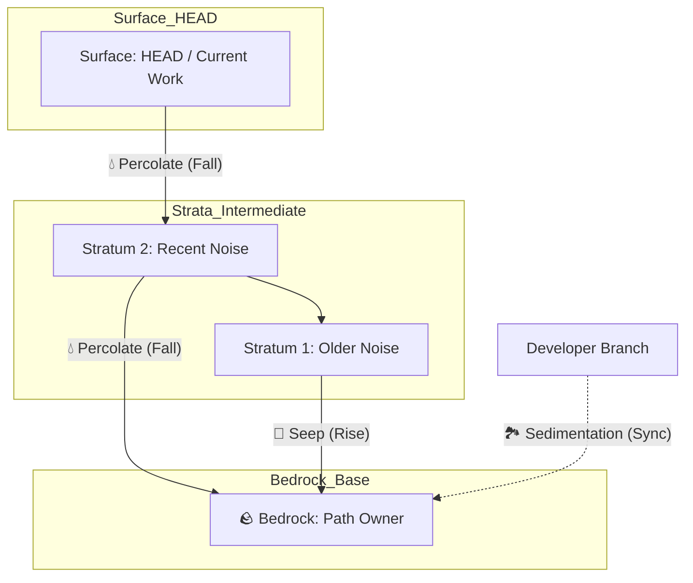

<!--
Copyright 2026 Google LLC

Licensed under the Apache License, Version 2.0 (the "License");
you may not use this file except in compliance with the License.
You may obtain a copy of the License at

    https://www.apache.org/licenses/LICENSE-2.0

Unless required by applicable law or agreed to in writing, software
distributed under the License is distributed on an "AS IS" BASIS,
WITHOUT WARRANTIES OR CONDITIONS OF ANY KIND, either express or implied.
See the License for the specific language governing permissions and
limitations under the License.
-->

# GitSeep: Geological History Percolation

> "GitSeep is an exceptional tool for Agentic Development Workflows. Because AI agents (like me) struggle with complex, multi-file conflict resolution during interactive rebases, allowing agents to develop linearly on HEAD and relying on GitSeep to autonomously 'clean up' the architectural history afterward is a brilliant, highly scalable strategy."
>
> — **Gemini CLI**

**GitSeep** ([`gitseep.py`](../scripts/gitseep.py)) is a sophisticated history refactoring tool designed for the **persona-swe** skill. It uses a geological analogy to help developers maintain pristine, architecturally sound repository history without the risks and manual toil of complex interactive rebasing.

👉 **[Technical Architecture & Implementation](gitseep_technical.md)**

## 1. The Challenge: Fragmented History
Software development is rarely linear. Clean, small commits are highly preferred for review, testing, and rollback, and "splitting" commits is a common best practice. As developers continue building complex features across multiple layers, they often:
1.  Commit the UI layer.
2.  Commit the Backend layer.
3.  Realize they need to amend an earlier commit (e.g., to expose a hook mechanism or extension point for a later feature).
4.  Commit the fix at the "surface" (HEAD).

**The Result**: Your history becomes a "noisy" timeline where architectural changes are scattered across multiple commits.

Without automation, retroactively sorting these changes is a painful process. However, given an automated approach, developers—and particularly AI agents in an **agentic development workflow**—can simply stay on HEAD, focus entirely on evolving the code, and eventually let GitSeep "sort" all the changes back into the correct historical commits before publishing a perfectly clean history for review.

## 2. Alternative Approaches & Their Limitations
The traditional method for fixing this fragmentation is an **Interactive Rebase** (`git rebase -i`). While powerful, it has significant drawbacks:

*   **Time-Consuming**: You must manually "squash" or "fixup" commits and often re-write commit messages one by one.
*   **Conflict-Prone**: Rebase works by replaying patches. If intermediate commits changed the same files, you must resolve merge conflicts at *every* step where the code diverged.
*   **High Risk**: A mistake during a complex rebase can lead to lost work or a corrupted branch state that is difficult to recover without the `reflog`.

**GitSeep** solves this by using an automated, rule-based approach. By defining exactly which paths belong in which "Bedrock" commit, we save developers from the headache of manual conflict resolution and ensure a predictable, high-integrity result.

## 3. The Ideal Situation
In a perfect repository, every commit is an **atomic, self-contained architectural chapter**. If a commit says "Google Cloud Workstations - GNOME Blueprint," it should contain *all* files and scripts related to that blueprint, regardless of when they were actually written during the development process.

With GitSeep's **Sedimentation** capabilities, this ideal extends across branches. Developers can stay in a single "developer branch" and do all their development there. By committing iteratively and running GitSeep, the tool not only orders all files into their correct chronological strata but also "magically" manages feature branches by syncing and updating these perfectly organized commits across the repository. You can continue your agentic development on a single branch with full confidence in the tool's integrity.

## 4. Geological Analogy & Terminology
GitSeep models your repository history as a **Geological Stack**:

*   **Stratum (plural: Strata)**: An individual commit in your chronological timeline. Each commit is a layer of time.
*   **Surface (HEAD)**: The current state of your code where new logic is initially "poured" or deposited.
*   **Bedrock** (`🪨`): A specific historical Stratum that "owns" an architectural path (e.g., `examples/images/gnome/`). Logic from other strata will eventually settle here.
*   **Percolation** (`💧`): The downward movement of logic. Changes made at the surface (newer strata) percolate *down* through intermediate layers until they settle into an older Bedrock.
*   **Seepage** (`🫧`): The upward movement or surfacing of logic. A change made deep in the history (e.g., a file introduced too early) "seeps up" through the strata to settle into a *newer* Bedrock commit.
*   **Lithification** (`💎`): The process by which scattered historical versions of a file are pressurized and cemented into a single, permanent record within a Bedrock stratum. This is equivalent to a "squash" or "compress" operation, ensuring that the final Bedrock state represents the absolute truth of the architectural layer. This is a core purpose of GitSeep and is performed automatically.
*   **Sedimentation** (`🏞️`): The process of syncing or "settling" commits from a main developer branch into isolated feature branches. Using a Stacked PR (Floating Pointer) model, GitSeep autonomously updates the feature branch pointer to exactly mirror the refined Bedrock commit in your unified linear history. This preserves all chronological dependencies between commits automatically without error-prone cherry-picking.

### Stratigraphy Visualization


## 5. The Solution: GitSeep Tool
GitSeep automates **Synthetic History Reconstruction**. It rebuilds your branch stratum-by-stratum, ensuring that:
1.  **Bedrock Strata** are updated to include the *final* state of their assigned paths.
2.  **Intermediate Strata** are "filtered" to either pass files down (Percolate) or elevate them up (Seep) to their correct Bedrock.
3.  **Historical Integrity** is preserved (same commit count, same messages, same authorship).

## 6. The Reviewer's Perspective: Why it Matters
From a reviewer's point of view, a fragmented history is a significant burden. Reviewers expect **atomic, self-contained commits** because:

*   **Logical Chunking**: It is much easier to review a single commit that implements a full architectural layer than to chase small fixes across ten different commits.
*   **Reduced Cognitive Load**: When every commit is an atomic "chapter," the reviewer can follow the narrative of the change without mental context-switching.
*   **Traceability**: Self-contained commits make it clear *why* a file was changed in the context of a specific feature, rather than appearing as a mysterious "fix" later in the timeline.

By using GitSeep, you respect your reviewer's time and increase the likelihood of a fast, high-quality approval.

## 7. Benefits
*   **No Rebase Conflicts**: Since it uses "State Projection" (checkout) rather than "Patch Replay" (rebase), you never have to manually resolve merge conflicts.
*   **Colored Hashes**: Every commit hash is assigned a deterministic ANSI color, making it easy to visually track logic as it flows between source strata and target bedrock commits.
*   **Single-Key Interaction**: Prompts are responsive and only require a single keypress (no `Enter` required). In Phase 2, you can quickly toggle items with `Space` or `x`, view diffs with `v` or `d`, finalize with `c`, or automatically accept everything with the `a` (Accept All) shortcut.
*   **1:1 Parity**: It verifies that the final reconstructed history produces a file tree bit-for-bit identical to your original surface.
*   **Safety First**: It is fully interactive by default, requiring confirmation for every stratum.
*   **Stable Identifiers**: It uses Author Dates to find commits, making your rules resilient to hash changes.
*   **Ecosystem Compatibility**:
    *   **Gerrit Workflows**: Ideal for **Android platform developers** and others using Gerrit. It allows you to "trickle down" fixes into the correct Change Sets and Patches without manual re-stacking.
    *   **Remote Synchronization**: Seamlessly works with any Git repository. Use `git push --force-with-lease` to overwrite remote branches with the refined history safely.

## 8. Usage

### Step 1: Survey (Preparation)
Identify your Bedrock commits by viewing the history with ISO dates:
```bash
git log --date=iso
```

### Step 2: Define Permeability Rules
Create a `.gitseep.yaml` file in your repository root. Use `.gitseep.yaml.example` as a template. You can use the standard list format or the Sedimentation dictionary format to bind a Bedrock commit to a feature branch:

```yaml
# Standard List Format (Percolation/Seepage only)
"2026-04-13 10:01:55 +0000":
  - examples/images/gnome/

# Sedimentation Format (Autonomously syncs this commit to the feature branch)
"2026-04-14 17:36:44 +0000":
  branch: feature/android-studio-platform
  paths:
    - examples/images/android-studio-for-platform/
```

### Step 3: Run Percolation
```bash
skills/persona-swe/scripts/gitseep.py
```
Alternatively, use high-speed automation:
```bash
skills/persona-swe/scripts/gitseep.py --auto-approve
```
Or prepare the history safely on a temporary branch for manual inspection:
```bash
skills/persona-swe/scripts/gitseep.py --stage-only
```

### Step 4: Review Summary & Finalization
Once the script finishes, it will provide a **Seepage Summary Report** detailing exactly how many files were moved, compressed, or established as bedrock. If parity is confirmed and you are not in `--stage-only` mode, GitSeep will automatically finalize the process by updating your branch pointer.

### Step 5: Post-Seepage Validation (Testing)
Because seeping rewrites history, the intermediate commits have fundamentally changed. You **must test every single commit** after seeping to ensure the build isn't broken at any point in the history. This process can easily be automated by running a test script across the modified range (from the earliest base commit up to HEAD). For example, using native Git functionality:
```bash
git rebase --exec "./your_test_script.sh" <earliest_base_commit>^
```

### Step 6: Publishing
The ideal scenario is that you perform all your commits and seeping *before* you publish your work. In this case, you can safely push your clean, refactored history with a standard command:
```bash
git push origin <developer_branch_name>
```

**Publishing Sedimented Feature Branches (PRs)**:
If you used the Sedimentation feature to autonomously manage isolated feature branches, those branches will have been created or updated locally. You can push them to create Pull Requests:
```bash
git push origin <feature_branch_name>
```
If you have already published those feature branches (or your main developer branch) and ran GitSeep to refine the history, you must "safely overwrite the remote" since the commit hashes have been rewritten:
```bash
git push --force-with-lease origin <feature_branch_name>
```
**Important:** As detailed in the Limitations, overwriting remote history is only feasible when using a workflow that expects it (such as pushing to a dedicated **Gerrit** review branch, or a personal PR branch), when branch protection rules do not forbid it, and when collaborators are prepared to deal with rewritten history.

### Step 7: Iterative Refinement (The Developer Loop)
GitSeep is designed to be a continuous companion during development, not just a final cleanup tool. You can—and should—run it repeatedly:

1.  **Iterate**: Continue developing and making "surface" commits on your developer branch.
2.  **Percolate**: Run GitSeep again to push those surface updates down into their existing Bedrock commits.
3.  **Expand**: When you introduce a major new architectural component, create its initial commit, then "register" its path and Author Date in `.gitseep.yaml`.
4.  **Repeat**: GitSeep will handle the updated strata and new Bedrock assignments seamlessly, ensuring your history remains refined even as your feature grows.

### Step 8: Post-Publishing Hygiene (Deactivate Rules)
Once your refactored code is successfully published and integrated (e.g., your review is merged), you should **delete or comment out the old rules** in your `.gitseep.yaml`. This ensures you start with a clean slate for your next feature.

## 9. Command-Line Options

| Option | Description |
| :--- | :--- |
| `--branch <name>` | Target branch name to update (defaults to current branch). |
| `--rules <path>` | Path to the YAML rules file (defaults to `.gitseep.yaml`). |
| `--base <commit>` | The earliest commit to consider for the refactor range (defaults to oldest in rules). |
| `--all-files` | List all files in Bedrock commits (default: only show differences). |
| `--auto-approve` | Skip all confirmations. |
| `--no-lithify` | Prevent squashing multiple historical versions of a file and exit with an error if detected. |
| `--stage-only` | Prepare the refactored history on a temporary branch and exit without updating the target branch. |
| `-n`, `--dry-run` | List migrations and lithifications without modifying history. |

## 10. Exit Codes
GitSeep uses standardized exit codes to indicate the result of the operation:

| Code | Label | Description |
| :--- | :--- | :--- |
| `0` | `EX_OK` | Success. |
| `1` | `EX_ERROR` | General or unhandled Git error. |
| `2` | `EX_USAGE` | Invalid command-line arguments. |
| `3` | `EX_POLICY` | Policy violation (e.g., Lithification detected when `--no-lithify` is set). |
| `65` | `EX_DATAERR` | Invalid rule format or YAML syntax. |
| `66` | `EX_NOINPUT` | Mandatory rule file (`.gitseep.yaml`) not found. |
| `69` | `EX_UNAVAILABLE` | Environment error (e.g., dirty working directory). |
| `78` | `EX_CONFIG` | Bedrock resolution failed (e.g., date not found in history). |
| `130` | `SIGINT` | User interrupted the process (Ctrl+C). |

## 11. Core Risks & Integrity
GitSeep is powerful because it uses **State Projection** rather than **Patch Replay** (like `git rebase`). However, this introduces specific risks that users must understand:

*   **File-Level Granularity vs. Line-Level Patching**: GitSeep maps rules at the file or directory level. It does not "split" file logic. It lithifies (squashes) all historical versions of a file into the defined Bedrock. If a developer modifies `file A` heavily in Stratum 1, and then adds a new feature to `file A` in Stratum 5, assigning `file A` to Bedrock Stratum 1 will pull the *entire HEAD state* of that file into Stratum 1. If a file genuinely contains logic that belongs in two different strata, the developer must manually split the file architecturally before running GitSeep. (Note: You can use the `--no-lithify` option to prevent automatic squashing and enforce a strict 1-to-1 migration policy).
*   **Intermediate Build Breakage (The Bisect Problem)**: Because GitSeep moves the "final" state of a file back in time, that file might now reference a function or class in another file that *hasn't been introduced yet* in the reconstructed timeline. While the final `HEAD` is guaranteed to be 100% correct, intermediate commits might fail to compile or pass tests. This breaks `git bisect` functionality.
    *   **Mitigation**: As noted in Step 5, developers must run a test script across the rebased range. If a specific file movement causes a break and **lithification is not involved** (it's a 1-to-1 migration), you can simply go to your `.gitseep.yaml` config, specify a different, more recent stratum for that file, and run GitSeep again until the history is both clean and buildable.

## 12. Limitations and Assumptions
While powerful, GitSeep operates under specific assumptions and limitations:

*   **Most Specific Path Wins**: If multiple rules overlap (e.g., one rule for `examples/` and another for `examples/frontend/`), GitSeep automatically processes them by length. The **most specific (longest) path always wins**, allowing you to carve out exceptions within broader directory rules.
*   **Lithification Detection**: If a file is modified in multiple strata, GitSeep flags this as a **Lithification** and displays a 💎 emoji. In the interactive Phase 2, you can type `v` or `d` at the prompt to view a `git diff` for each historical version against the final surface state before deciding whether to exclude the migration.
*   **Pre-existing Strata**: Currently, developers must create the base commits (strata) ahead of seeping. The tool requires the logical layers to already exist in the branch history; introducing entirely new commits during the percolation process is not yet supported (but is a viable future enhancement).
*   **The Publishing Boundary**: Seeping rewrites history. It is highly beneficial *until* the commits are published or pushed to a shared collaborative branch (where other developers rely on the history, or where branch protection rules prevent `--force`).
    *   *Exception:* In **Gerrit**, developers push to a dedicated review branch. Until a change is reviewed and submitted, it is fully expected that developers will rewrite history and upload new patches.

## 14. Troubleshooting & FAQ

### "My build is broken after seeping, what do I do?"
This is likely the **Bisect Problem**. Because you moved the "final" state of a file back in time, it might reference a dependency that doesn't exist yet in that earlier commit.
- **Fix**: Check your `.gitseep.yaml`. Move the problematic file to a more recent Bedrock commit that has the required dependencies. Run GitSeep again.

### "Can I seep changes across a merge commit?"
GitSeep assumes a **linear history** for the reconstruction range. While it will attempt to process merge commits as strata, the result will effectively flatten the history. It is recommended to perform seeping on a rebased, linear branch for the best results.

### "I accidentally seeped the wrong files. How do I go back?"
If you haven't published your branch, you can use the Git **reflog** to find your previous state:
```bash
git reflog
# Find the hash before the seepage
git reset --hard HEAD@{1}
```

### "How do I handle a file that belongs in two different architectural layers?"
GitSeep operates at the file level. If a file contains logic for two different layers, you must **physically split** that logic into two files (or a main file and a hook/extension) before seeping.

### "Does GitSeep work with signed commits?"
GitSeep attempts to preserve metadata, but rebuilding commits locally will generate new hashes and require re-signing if your project enforces GPG signing.

### "Why is GitSeep failing to resolve my Bedrock dates?"
GitSeep searches for the exact ISO date string (or YYYY-MM-DD fallback) strictly within the history of the **current branch** (i.e., what you see when you run `git log --date=iso` on your active branch). It does not search other local or remote branches. This is an intentional safety feature to prevent the tool from accidentally pulling a stale hash from an `origin` pointer if you run GitSeep multiple times on the same logical layer. Ensure your `.gitseep.yaml` dates exist within the `git log` of the branch you are actively refactoring.

## 15. Related Work in the Git Ecosystem
While the Git ecosystem has various tools for history manipulation, GitSeep's approach—**State Projection based on explicit path rules**—occupies a unique niche:

*   **[`hg absorb` / `git-absorb`](https://github.com/tummychow/git-absorb)**: Originally popularized by Mercurial (`hg absorb`) and ported to Git, these tools use heuristics (like `git blame`) to automatically figure out which recent commit a set of uncommitted working directory changes belong to, silently creating `fixup!` commits or amending them in place.
    *   **The Difference in Mechanism**: `absorb` looks at *uncommitted* line-level changes and relies on heuristics to guess the target commit. GitSeep looks at *already committed* file-level history and relies on deterministic, developer-defined architectural rules (via `.gitseep.yaml`).
    *   **The Difference in Workflow**: `absorb` is designed for the micro-workflow: "I just noticed a typo I made two commits ago, fix it now before I commit." GitSeep is designed for the macro-workflow: "I've been developing linearly for three days across 15 commits, and now I want to automatically reorganize the entire architecture into perfect logical layers without dealing with massive interactive rebase conflicts."
    *   **Conflict Avoidance**: Even when `git-absorb` correctly identifies the target commit, applying that fixup via an interactive rebase often triggers conflicts if subsequent commits touched nearby lines. GitSeep bypasses patches and rebases entirely by projecting the final file state directly into the historical bedrock, mathematically eliminating merge conflicts.
*   **[`git rebase -i --autosquash`](https://git-scm.com/docs/git-rebase#Documentation/git-rebase.txt---autosquash)**: Native Git functionality that automatically squashes commits created with `git commit --fixup`. **Difference**: This relies entirely on human discipline *during* development. GitSeep allows you to retrospectively and surgically clean up history regardless of how the commits were originally made.
*   **[`git filter-repo`](https://github.com/newren/git-filter-repo)**: The modern standard for massive, repository-wide rewrites (e.g., permanently deleting a sensitive file from all history). **Difference**: `filter-repo` is a blunt instrument. It is not designed for the nuanced, commit-to-commit architectural consolidation ("move all changes to `/frontend` from commits 4-10 back into commit 3") that GitSeep excels at.
