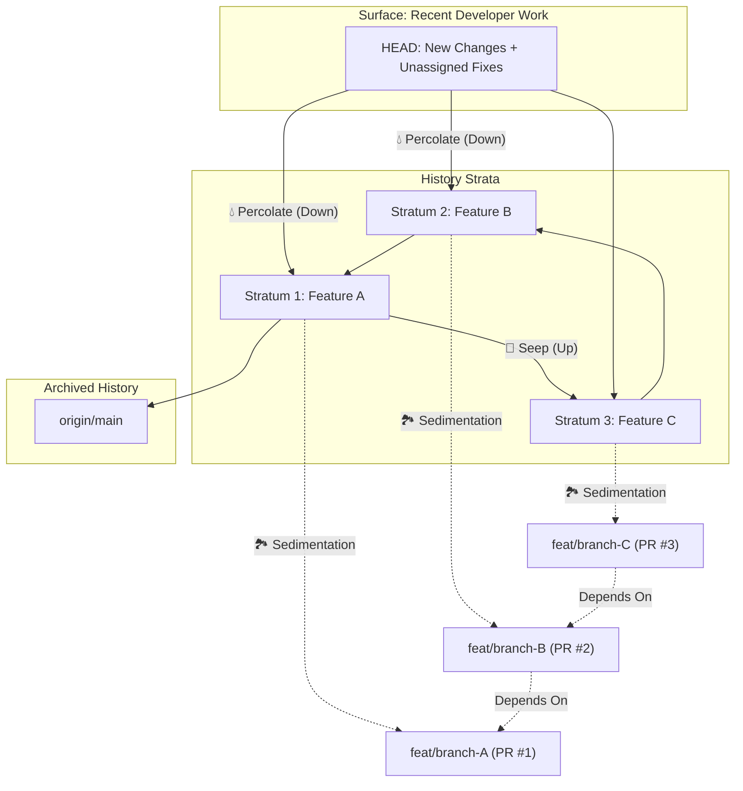

<!--
Copyright 2026 Google LLC

Licensed under the Apache License, Version 2.0 (the "License");
you may not use this file except in compliance with the License.
You may obtain a copy of the License at

    https://www.apache.org/licenses/LICENSE-2.0

Unless required by applicable law or agreed to in writing, software
distributed under the License is distributed on an "AS IS" BASIS,
WITHOUT WARRANTIES OR CONDITIONS OF ANY KIND, either express or implied.
See the License for the specific language governing permissions and
limitations under the License.
-->

# GitSeep: User Manual

> "GitSeep is an exceptional tool for Agentic Development Workflows. Because AI agents (like me) struggle with complex, multi-file conflict resolution during interactive rebases, allowing agents to develop linearly on HEAD and relying on GitSeep to autonomously 'clean up' the source code history afterward is a brilliant, highly scalable strategy."
>
> — **Gemini CLI**

**GitSeep** is a sophisticated **Source Code History Orchestrator**. It helps developers and AI agents maintain a pristine, structurally sound source code history without the risks and manual toil of complex interactive rebasing.

By mathematically projecting changes into their correct historical strata, GitSeep enables a **Flow-State Workflow**: focus entirely on your logic by developing linearly on `HEAD`, and let GitSeep autonomously sort your files into atomic commits and generate Stacked PR feature branches.

👉 **[Design Document](gitseep_design.md)**
👉 **[Product Requirements](gitseep_requirements.md)**

## 1. When to Use GitSeep (Strategic Fit)

GitSeep is a "force multiplier" for projects with high **stratigraphic complexity**—where the repository history isn't just a line of commits, but a structured stack of architectural layers.

### Ideal Use Cases

- **Infrastructure-as-Code (IaC) & Platform Engineering:** When a single repository manages multiple layers like OS images, Kubernetes manifests, and application code. Changes often cross these boundaries (e.g., fixing a bug in the OS layer while updating the app). GitSeep allows you to develop linearly on HEAD while ensuring modifications to the "OS Bedrock" settle into the correct historical stratum, keeping the "App-layer sediment" clean.
- **Multi-Layer Container Image Stacks:** For projects managing a hierarchy of customized environments. When building complex image stacks—such as a base platform layer, followed by a desktop environment layer, and finally specialized toolset layers—GitSeep ensures that a fix in the foundation (e.g., a core system library or configuration) is correctly sedimented into its specific bedrock history without polluting the specialized tools or application logic layered above it.
- **Vertical Slice Development in Monorepos:** Teams working on large projects like **Android (AOSP)** or **Chromium**. A single feature might touch the Kernel/HAL, the Framework, and a System App. GitSeep automates the "re-layering" of these changes so that when specialized teams (e.g., the Kernel team) look at their history, they only see relevant "bedrock" changes, even if the work was done simultaneously across layers.
- **Deep Architectural Layering (GCP Infra, V8, Blink):** In projects with long-lived, high-impact core libraries (e.g., gRPC, Abseil). When a new feature requires a change in a core "bedrock" library _and_ the service using it, GitSeep ensures the core library's history remains geologically pure, preventing feature-layer "sediment" from leaking into the foundations.
- **Stacked Pull Requests (Feature Branching):** When maintaining a chain of dependent PRs. GitSeep's **Sedimentation** feature autonomously manages the Directed Acyclic Graph (DAG) of your branches, syncing your main development flow into isolated, buildable PR branches.

### When GitSeep is Less of a Fit

- **Flat Microservices:** Simple applications with a single layer and a "Squash-and-Merge" culture where history integrity isn't a long-term priority.
- **Short-lived Projects:** Repositories that are rarely maintained for more than a few months.
- **Purely Linear, Single-Layer Repos:** Where every change is conceptually at the same architectural level.

## 2. Why GitSeep?

### The Agentic Development Workflow

AI agents are excellent at generating code but struggle with the spatial and chronological complexity of resolving merge conflicts during a `git rebase -i`. GitSeep solves this. Agents can commit linearly (e.g., "Fix UI", "Add Backend", "Fix UI again"). GitSeep then uses declarative rules to pull all UI changes into the single "UI Commit" and all Backend changes into the "Backend Commit", mathematically eliminating rebase conflicts.

### Stacked PRs & Fully-Managed Branches

GitSeep isn't just for cleaning history on a single branch. With its **Sedimentation** feature, GitSeep autonomously manages feature branches. You define your architectural layers in `.gitseep.yaml`, and GitSeep will automatically update isolated feature branches, correctly cherry-picking dependencies to weave a complex Directed Acyclic Graph (DAG) for Stacked Pull Requests.

## 3. Geological Analogy & Terminology

GitSeep models your repository history as a **Geological Stack**:

- **Stratum (plural: Strata)**: An individual commit in your chronological timeline. Each commit is a layer of time.
- **Surface (HEAD)**: The current state of your code where new logic is initially deposited.
- **Bedrock** (`🪨`): A specific historical Stratum that "owns" a source code path. Logic from other strata will eventually settle here.
- **Percolation** (`💧`): The downward movement of logic. Changes made at the surface (newer strata) percolate _down_ through intermediate layers until they settle into an older Bedrock.
- **Seepage** (`🫧`): The upward movement of logic. A change made deep in the history "seeps up" through the strata to settle into a _newer_ Bedrock commit.
- **Lithification** (`💎`): The process of "squashing" multiple historical versions of a file into a single, permanent record within a Bedrock stratum.
- **Sedimentation** (`🏞️`): The process of syncing or "settling" commits from your main developer branch into isolated feature branches (Stacked PRs).

### Stratigraphy Visualization


```mermaid
graph TD
    subgraph Surface_HEAD ["Surface: Recent Developer Work"]
    H["HEAD: New Changes + Unassigned Fixes"]
    end

    subgraph Strata_Range ["History Strata"]
    S3["Stratum 3: Feature C"]
    S2["Stratum 2: Feature B"]
    S1["Stratum 1: Feature A"]
    end

    subgraph Bedrock_Base [Archived History]
    Base[origin/main]
    end

    H -- "💧 Percolate (Down)" --> S2
    H -- "💧 Percolate (Down)" --> S1
    S1 -- "🫧 Seep (Up)" --> S3

    S1 --> Base
    S2 --> S1
    S3 --> S2
    H --> S3

    %% Sedimentation & Stacked PR example
    S1 -. "🏞️ Sedimentation" .-> BranchA["feat/branch-A (PR #1)"]
    S2 -. "🏞️ Sedimentation" .-> BranchB["feat/branch-B (PR #2)"]
    S3 -. "🏞️ Sedimentation" .-> BranchC["feat/branch-C (PR #3)"]

    BranchB -. "Depends On" .-> BranchA
    BranchC -. "Depends On" .-> BranchB
```

## 4. Workflow: Organizing Files & Creating Stacked PRs

### Step 1: Survey (Preparation)

Identify your Bedrock commits by viewing the history with ISO dates:

```bash
git log --date=iso
```

### Step 2: Define Rules (`.gitseep.yaml`)

Create a `.gitseep.yaml` file in your repository root. Use the **Sedimentation Format** to bind a Bedrock commit to a feature branch and define its topological parent. This is how GitSeep knows how to build your Stacked PRs:

```yaml
# Example: .gitseep.yaml
config:
  base_ref: origin/main

"2026-04-14 17:36:44 +0000":
  branch: feat/android-studio-platform
  parent: feat/android-studio-for-platform # Explicit Topological Dependency
  paths:
    - examples/images/android-studio-for-platform/

"2026-04-13 10:01:55 +0000":
  branch: feat/android-studio-for-platform
  paths:
    - examples/images/gnome/
```

### Step 3: Run GitSeep

Execute the tool. It will launch a **Unified Dashboard** featuring a multi-tab Terminal UI. You can navigate between views at any time while the background pipeline executes:

- **1 Stratigraphy:** Review the resolved bedrock hierarchy and mapping rules. Supports interactive expansion (`SPACE`) and **Batch Expand/Collapse (`a`)**. Uses a **Lane-Based Tree** to visualize architectural dependencies.
- **2 Selection:** Interactively review and approve file migrations (indicated by ✋). Press `SPACE` to toggle individual files, or **`a` to Toggle All**. Branding is fixed with a 🎯 target icon.
- **3 Validation:** Real-time progress of the isolated `pre-commit` test suite, mirroring the lane-based geometry of the Stratigraphy tab.
- **4 Summary:** A read-only overview of all successfully migrated files. This tab appears automatically after successful validation. Press **ENTER** to finalize and exit.

**Global Controls:**

- **`V`**: Toggle Validation. Disabling this bypasses the safety checks for the current session. The tab title will show **(Skipped)** when disabled.
- **`ENTER`**: Proceed / Confirm / Finish (Final completion).
- **`L`**: Toggle Application Logs dialog. Supports scrolling with **Up/Down/PgUp/PgDown**. Press any other key to close.
- **`?`**: Toggle Help.
- **Numbers (`1-3`)**: Direct access to any tab.
- **Arrow Keys / `Tab`**: Switch between tabs.
- **`Up/Down` / `PgUp/PgDn`**: Scroll through lists and logs.

> **Performance Note:** GitSeep utilizes a **Hybrid Performance Model**. It is highly recommended to have the system `git` binary installed in your environment. GitSeep will leverage it for near-instant repository safety checks and amendments, while using its internal Go engine for the core geological history reconstruction.

### The Staged-Only Amendment Mandate

To ensure a seamless **Flow-State Workflow**, GitSeep always performs a **Mandatory Staged Amendment** before starting its geological reconstruction.

- **Explicit Intent**: GitSeep performs a `git commit --amend --no-edit` strictly on **already staged** changes.
- **No Implicit Adds**: It will never perform a `git add`. Only modifications you have explicitly staged (manually or via an agent) are folded into the history.
- **Agent Safety**: This "Staged-Only" policy prevents race conditions in multi-agent environments by ensuring that only deliberate modifications are included in the geological projection.

```bash
gitseep
```

For high-speed, non-interactive automation (common for AI Agents):

- **`-y` (Auto-Approve)**: Triggers **Headless Mode**. Bypasses the TUI, auto-approves all detected migrations, but still streams detailed engine logs to the terminal.
- **`-q` (Quiet)**: Triggers **Headless Mode**. Delivers a completely silent, synchronous execution (except for errors). Ideal for CI/CD or background tasks.

```bash
gitseep -q
```

### Step 4: Automated Validation (The Bisect Problem)

Because GitSeep mathematically projects the "final" state of a file back in time, that file might reference a dependency that hasn't been introduced yet in the reconstructed timeline (The Bisect Problem). To guarantee that **every commit in your history remains buildable**, GitSeep includes a built-in isolated validation phase.

By default, after generating the new history, GitSeep creates a highly performant **isolated git worktree**. You can monitor this process in the **Validation Tab**, which displays real-time progress. The UI employs a **'Gravity' layout** (modern work at the top), with a pointer icon (**👉**) moving downward as validation progresses from the modern **Surface** toward the historical bedrock.

**Surface Check (Phase 3):**
GitSeep validates the current `HEAD` in parallel with your discovery and selection process. This "Surface Check" blocks the execution of any history reconstruction until your current workspace is confirmed clean.

**Dynamic Diagnostics:**
The Validation tab features a **permanent 7-line diagnostic window** (bottom-aligned). As hooks execute, their real-time output is streamed into this window, providing high-fidelity feedback without vertical jitter.

**Unified Troubleshooting Exit:**
If any test fails, GitSeep provides a **Consolidated Troubleshooting Summary**. GitSeep explicitly distinguishes between **"Internal Pipeline Errors"** (e.g., repository integrity or checkout issues) and **"Validation Failures"** (code quality issues). Pressing **any key** when the failure dialog is visible will exit the TUI and:

1.  **Identify** exactly which commit and files caused the failure (displaying hash, date, and message).
2.  **Display** the full captured pre-commit logs directly in your terminal.
3.  **Provide** clear, copy-pasteable instructions:
    - `cd` command to the failing workspace (either your root or a preserved isolated worktree).
    - Manual reproduction command (e.g. `git checkout -f -q [hash]` or `SKIP=gitseep-check pre-commit run --files ...`).
    - Cleanup command to remove temporary worktrees when you're finished.

**Optimization:**

- **Anchor Identification:** GitSeep identifies your `base_ref` as an anchor point, automatically focusing validation only on new work.
- **Surgical Execution:** It calculates exact file diffs and executes `pre-commit run --files` strictly on modified files.
- **Zero-Change Short-Circuit:** If no files are approved for migration or the history is already perfectly sedimented, the engine **bypasses reconstruction and validation entirely**, providing an instantaneous exit.
- **Validation Depth Pruning:** GitSeep automatically detects unchanged strata. If a reconstructed commit is identical to its original version, the engine **breaks the validation loop**, as all deeper ancestors are guaranteed to be valid. This significantly reduces execution time for deep geological histories.

### Safety & Isolation: The Sandbox Model

GitSeep utilizes isolated **Git Worktrees** for all validation tasks (both Surface and Strata). This "Sandbox Model" provides four critical guarantees:

1.  **Zero Mutation Principle:** Many `pre-commit` hooks are designed to automatically fix issues (e.g., `gofmt`, `prettier`). By running in an isolated worktree, GitSeep ensures that automated fixes never modify your original source code or staging area. You remain in complete control of your workspace.
2.  **Concurrency Safety:** The Surface Check runs in parallel while you interact with the Dashboard. Isolation prevents conflicts between the validation engine and your active development session (e.g., file locks or "dirty worktree" errors).
3.  **Non-Destructive Finalization:** To handle cases where an agent or developer continues to work while GitSeep is running, the tool uses a **"Safe Pointer Move"** strategy (Mixed Reset). It updates your branch pointer and staging area (index) to match the new geological history but **never touches your worktree**. This ensures that any unstaged or untracked changes made during execution are perfectly preserved.
4.  **The Bisect Guarantee:** By validating the "Surface" and "Strata" in identical isolated environments, GitSeep guarantees that the buildability of your reconstructed history is technically consistent and reliable.

### Step 5: Publish Stacked PRs

Once buildability is verified across the entire history, publish your feature branches:

```bash
git push --force-with-lease origin feat/android-studio-for-platform
git push --force-with-lease origin feat/gnome
```

## 5. Known Limitations & Hunk Granularity

GitSeep operates at the **file and directory level**. It mathematically moves entire files across time. It _cannot_ automatically split a single file into different commits if it contains unrelated changes (hunks).

## 6. Command-Line Options

| Option                  | Description                                                    |
| :---------------------- | :------------------------------------------------------------- |
| `--config <path>`, `-c` | Path to the YAML rules file (defaults to `.gitseep.yaml`).     |
| `--base <commit>`       | The earliest commit to consider for the refactor range.        |
| `--branch <name>`, `-b` | The name of the target branch to update (defaults to current). |
| `--auto-approve`, `-y`  | Skip all interactive confirmations (Triggers Headless Mode).   |
| `--quiet`, `-q`         | Suppress all non-error output (Triggers Headless Mode).        |
| `--skip-pre-commit`     | Skip isolated pre-commit validation phase.                     |
