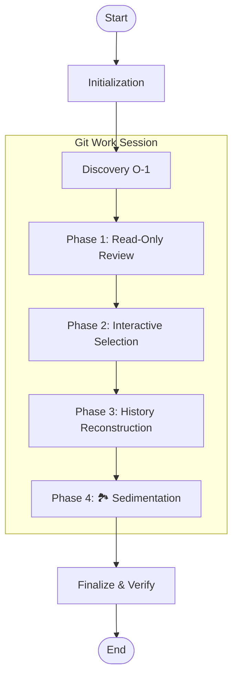
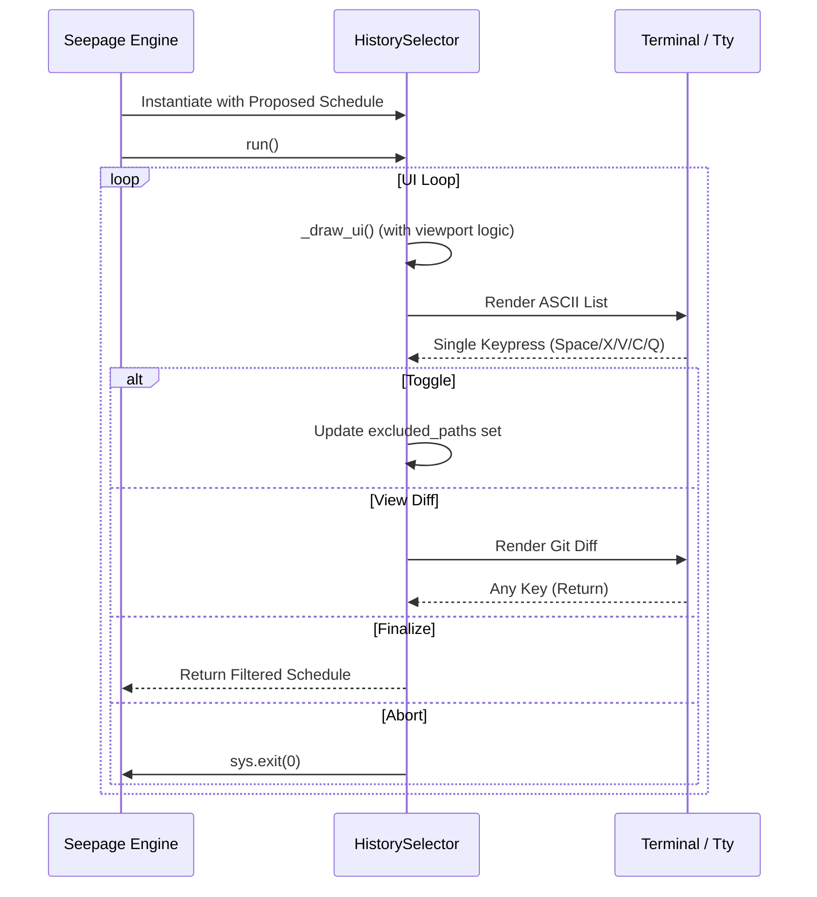

<!--
Copyright 2026 Google LLC

Licensed under the Apache License, Version 2.0 (the "License");
you may not use this file except in compliance with the License.
You may obtain a copy of the License at

    https://www.apache.org/licenses/LICENSE-2.0

Unless required by applicable law or agreed to in writing, software
distributed under the License is distributed on an "AS IS" BASIS,
WITHOUT WARRANTIES OR CONDITIONS OF ANY KIND, either express or implied.
See the License for the specific language governing permissions and
limitations under the License.
-->

# GitSeep: Technical Architecture & Implementation

**Version**: 1.3.0
**Language**: Python 3.10+
**Primary Metaphor**: Geological Stratigraphy

## 1. Core Philosophy: State Projection vs. Patch Replay
Unlike traditional `git rebase`, which operates on **patches** (diffs) and is subject to merge conflicts, GitSeep operates on **State Projection**.

### The Mechanism
1.  **Isolation**: GitSeep creates a unique, isolated work branch (`gitseep-work-<uuid>`) based on the parent of the earliest bedrock commit.
2.  **Reconstruction**: It iterates through every "Stratum" (commit) in the original history range.
3.  **Hard Injection**: For paths defined in the rules, it uses `git checkout <surface_head> -- <path>` to force the path to its final intended state.
4.  **Atomic Committing**: It captures the state of the index exactly as it stands, effectively bypassing the logic-conflict risks inherent in replaying incremental changes.

## 2. System Architecture

### 2.1 The Execution Pipeline
GitSeep follows a strictly linear pipeline. The `git_work_session` context manager wraps the middle four phases to ensure atomicity.



### 2.2 UI Engine Interaction
The `HistorySelector` class manages a state machine for terminal interaction during Phase 2.



### 2.3 Data Structures

#### `SeepageContext` (Data Class)
The "Source of Truth" for a session. It is immutable after initialization and carries:
- `resolved_rules`: Mapping of commit hashes to lists of architectural paths.
- `path_to_bedrock`: A flattened lookup for the "Most Specific Path Wins" logic.
- `strata`: A chronologically ordered list of all commit hashes in the range.

#### `SeepageSummary` (Data Class)
A mutable accumulator for telemetry and report generation:
- Tracks `seep_files` (upward migration), `percolate_files` (downward migration), and `lithified_files` (squashed history).
- Captures `sedimented_branches` for the final synchronization report.

## 3. Implementation Details

### 3.1 Transactional Integrity (`git_work_session`)
The tool employs a custom Python context manager to provide a **transactional guarantee**. If the script is interrupted (SIGINT) or encounters a runtime error:
- It automatically performs a hard reset to the state before the script started.
- It returns the user to their original branch.
- It ensures no "junk" temporary branches are left dangling in a detached HEAD state.

### 3.2 Discovery Optimization
GitSeep optimizes history discovery to $O(1)$ Git invocations by using a batched log format:
```bash
git log --format=[%H] --name-only {base}^..HEAD
```
The internal parser processes this stream in a single pass to build the `proposed_schedule` and `sources` maps, avoiding the performance penalty of calling `git show` for every individual commit.

### 3.3 Rule Resolution: Most Specific Path Wins
If rules overlap (e.g., `/src` and `/src/core`), GitSeep applies a "Longest Prefix" match. This is implemented by sorting all active rule paths by length in descending order during the discovery pass. This allows developers to define broad defaults while surgically carving out exceptions for specific sub-directories.

### 3.4 Interactive UI (`HistorySelector`)
Phase 2 uses a stateful `HistorySelector` class that wraps `termios` and `tty` for raw-mode input handling.
- **Scrolling**: Implements a virtual viewport logic (`scroll_offset`) to handle large file lists that exceed the terminal height.
- **Selection**: Maintains a `excluded_paths` set that is used to filter the `proposed_schedule` before history reconstruction begins.

## 4. Operational Safety

### 4.1 Exit Code Standard
GitSeep adheres to a strict exit code hierarchy for integration with CI/CD and automation scripts:
- `0 (OK)`: Success.
- `1 (ERROR)`: General failure or unexpected Git state.
- `3 (POLICY)`: Explicit policy violation (e.g., Lithification detected with `--no-lithify`).
- `69 (UNAVAILABLE)`: Environment issue (e.g., Dirty worktree).

### 4.2 Metadata Preservation
During history reconstruction, the tool extracts and re-applies full commit metadata using a robust delimiter (`|DELIM|`). This ensures that Author Name, Email, Date, and Committer Name/Email/Date remain bit-for-bit identical to the original history, preserving the social record of the repository.

## 5. Known Constraints

### 5.1 The Bisect Problem
Because state is projected backward in time, intermediate commits may reference dependencies that haven't been "born" yet in the reconstructed timeline. GitSeep guarantees final HEAD parity but does not natively guarantee intermediate buildability. Users are encouraged to run `git rebase --exec` for automated validation of the reconstructed range.

### 5.2 Linear History Assumption
The current implementation assumes a linear history within the refactor range. Complex merge-topologies within the strata range may produce unexpected results or be flattened into a linear reconstruction.
