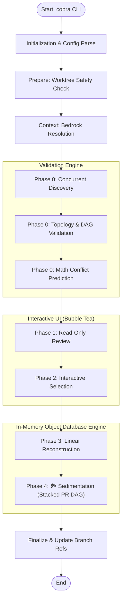

<!--
Copyright 2026 Google LLC

Licensed under the Apache License, Version 2.0 (the "License");
you may not use this file except in compliance with the License.
You may obtain a copy of the License at

    https://www.apache.org/licenses/LICENSE-2.0

Unless required by applicable law or agreed to in writing, software
distributed under the License is distributed on an "AS IS" BASIS,
WITHOUT WARRANTIES OR CONDITIONS OF ANY KIND, either express or implied.
See the License for the specific language governing permissions and
limitations under the License.
-->

# GitSeep: Technical Architecture & Implementation

- **Version**: 2.0.0
- **Language**: Go 1.24+
- **Core Engine**: `github.com/go-git/go-git/v5`
- **Primary Metaphor**: Geological Source Code History Percolation

## 1. Core Philosophy: Pure In-Memory Reconstruction

Unlike traditional `git rebase` or the legacy Python implementation of GitSeep (which relied heavily on slow `os/exec` subprocesses and physical disk I/O), GitSeep v2 operates entirely **In-Memory** using the Git Object Database.

### The Mechanism

1.  **Isolation**: GitSeep reads the target `Commit` and `Tree` objects directly from `.git/objects` into memory.
2.  **Reconstruction**: It iterates through every "Stratum" (commit) in the original history range.
3.  **Mathematical Delta**: It calculates the exact `merkletrie` delta required to force paths defined in the `.gitseep.yaml` rules to their final intended state.
4.  **Atomic Injection**: It builds the new nested `object.Tree` structures in RAM, hashes them, and directly injects the new `Commit` objects back into the Git database without ever modifying your working directory.

## 2. System Architecture

### 2.1 The Execution Pipeline

GitSeep leverages Go's concurrency model to vastly accelerate the pipeline. The engine follows a **Decoupled Architecture** that strictly separates preparation, validation, and execution.

### 2.2 Phase 0: Discovery & Topology (Concurrency)

GitSeep optimizes history discovery by spawning a worker `goroutine` for every single commit in the strata range using `golang.org/x/sync/errgroup`.

- **Thread-Safe resolution**: To prevent `fatal error: concurrent map writes` in the `go-git` object cache, GitSeep utilizes a surgical `sync.Mutex` during the initial `Commit` and `Tree` resolution.
- **Concurrent Diffing**: Once objects are resolved, the heavy lifting of `merkletrie` tree diffing and path matching occurs concurrently without locks.
- Kahn's Algorithm runs a Topological Sort on the declared Stacked PR dependencies to instantly detect cyclical loops.
- The conflict prediction engine mathematically cross-references the `TouchedBy(S)` sets to guarantee that Phase 4 cherry-picks will succeed perfectly without merge conflicts.

### 2.3 UI Engine Interaction (Bubble Tea)

Phase 2 abandons raw VT100 escape codes in favor of the Elm-inspired **Charmbracelet** ecosystem.

- **`bubbletea`**: Manages the asynchronous event loop, raw terminal mode, and responsive pagination natively.
- **`lipgloss`**: Handles deterministic, cross-platform ANSI styling (colors, margins) that gracefully degrades in CI environments.

## 3. History Orchestration Primitives

### 3.1 Zero-Mutation & Shared History Guarantee

GitSeep features a mathematical **Zero-Mutation Guarantee** to prevent CI/CD spam.

- **Linear Pruning (Phase 3)**: The engine reuses original commit hashes if the reconstructed tree and parents match the original stratum exactly.
- **Linear Parent Inheritance (Phase 4)**: Feature branches without an explicit parent now inherit the actual parent from the reconstructed linear history. This ensures that intermediate "unassigned" commits (e.g., whitespace fixes) are shared between your development branch and your feature branches.
- **Shared History Optimization (Phase 4)**: If a feature branch's topological parent matches the parent of the reconstructed linear bedrock, GitSeep **reuses the linear commit hash directly**. This guarantees bit-for-bit hash identity across your entire branch DAG where history is logically identical.
- **DAG Pruning (Phase 4)**: Branch updates are skipped if the target tree, parent, and message are already up-to-date.

### 3.2 Zero-Loss Surface Injection

To ensure developers never lose work (like a new `.gitseep.yaml` or generated reports), GitSeep implements a **Zero-Loss mechanism**. In the final commit of the reconstructed stack, the engine automatically detects files present at the current `HEAD` that were never part of the historical strata and were not managed by any rule. These are injected into the final commit, ensuring your workspace state is faithfully preserved.

### 3.3 Phase 2 Early Exit

GitSeep monitors the interactive Phase 2 (Selective Exclusion). If no files are flagged for migration (either because the history is already perfectly sedimented or the user manually excluded all pending migrations), the execution pipeline is preempted early. The tool will gracefully exit without triggering the computationally expensive Phase 3 and Phase 4, resulting in a cleaner user experience and instantaneous execution when no work is required.

## 4. Operational Safety & Robustness

### 4.1 Safe Worktree Update

While history is built in memory using `go-git`, GitSeep delegates the final workspace synchronization to a system call by default: **`git reset --hard`**.

- **Robustness**: The system binary correctly handles complex symbolic links and file modes that often trigger false-positive "dirty" states in library implementations.
- **Untracked Safety**: This command only synchronizes tracked files; it is mathematically guaranteed to leave your untracked files (like local secrets or new directories) untouched.
- **Experimental Fallback**: The hidden flag **`--experimental-go-git`** allows users to toggle both the initial **Status** check and the final **Checkout** phase back to the `go-git` library for future debugging and library parity testing.

### 4.2 Thread-Safe Discovery

GitSeep ensures stability during high-speed concurrent discovery by using a `sync.Mutex` to guard all `go-git` repository object resolution. This prevents `fatal error: concurrent map writes` within the library's internal caches while allowing path matching and diffing to remain highly parallelized.

### 4.3 Pre-Commit Integration (`gitseep check`)

The CLI exposes a dedicated `check` subcommand optimized for CI pipelines and `.pre-commit-config.yaml` hooks. It performs Phase 0 (Topology Validation & Conflict Prediction) and verifies the workspace is clean (`git.IsDirty`) without executing the full UI or memory reconstruction pipeline, returning an instant exit code `0` or `1`.

### 4.4 Metadata Preservation

During memory reconstruction, the tool directly copies the `object.Signature` structures. This ensures that Author Name, Email, Date, and Committer Name/Email/Date remain bit-for-bit identical to the original history, perfectly preserving the social record of the repository.

### 4.5 Exit Code Standard

GitSeep adheres to a strict exit code hierarchy (defined in `config.go`) for integration with automation scripts:

- `0 (OK)`: Success.
- `1 (ERROR)`: General failure or unexpected Git state.
- `3 (POLICY)`: Explicit policy violation.
- `65 (DATAERR)`: YAML Configuration parsing error.

## 5. Known Constraints

### 5.1 The Bisect Problem

Because state is mathematically projected backward in time, intermediate commits may reference dependencies that haven't been "born" yet in the reconstructed timeline. GitSeep guarantees final HEAD parity but does not natively guarantee intermediate buildability. Users are encouraged to run `git rebase --exec` for automated validation of the reconstructed range.

### 5.2 Linear History Assumption

The current implementation assumes a linear history within the refactor range (the target `dev` branch). Complex merge-topologies within the strata range may produce unexpected results or be flattened into a linear reconstruction.
